# 🏦 Apna Neo Finance Bank

A **Django-based banking application** simulating real-world banking operations. Developed as a **personal project** with secure authentication, loans, investments, cards, branch finder, user dashboard, net banking, and more.

---

## ✨ Key Features

| Feature                 | Status     | Description                                                                          |
| ----------------------- | ---------- | ------------------------------------------------------------------------------------ |
| 🔐 User Authentication  | ✅ Complete | Secure registration & login                                                          |
| 🏦 Account Management   | ✅ Complete | Open & manage bank accounts                                                          |
| 💰 Loan Processing      | ✅ Complete | Loan page with different departments                                                 |
| 💳 Cards Management     | ✅ Complete | Card page with different types                                                       |
| 📈 Investment Portfolio | ✅ Complete | Investment page                                                                      |
| 🏢 Branch Locator       | ✅ Complete | Find nearby bank branches                                                            |
| 🎯 User Dashboard       | ✅ Complete | Personalized banking dashboard for user account                                      |
| 🆘 Support System       | ✅ Complete | Customer support & helpdesk page                                                     |
| 🌐 Net Banking          | ✅ Complete | Full online banking functionality with fund transfer, transactions, and virtual card |

---

## 🛠 Tech Stack

**Backend:** Python 3.8+, Django 4.0+
**Frontend:** HTML5, Tailwind CSS, Django Templates
**Database:** Django ORM
**Version Control:** Git & GitHub

---

## 📁 Project Structure

```
apna_neo_finance_bank/
├── accounts/               # User authentication & profiles
├── banking/                # Core banking operations
├── services/               # Loans, investments, cards
├── support/                # Customer support system
├── core/                   # Main app & templates
├── static/                 # CSS, JS, images
├── templates/              # HTML templates
├── anfb_screenshots/       # Screenshots for README
├── manage.py
├── requirements.txt
├── .gitignore
└── README.md
```

---

## 🚀 Quick Start

### Prerequisites

* Python 3.8+
* pip
* Git
* Django Framework

### Installation & Setup

```bash
# Clone repository
git clone https://github.com/abh0x1/Apna-Neo-Finance-Bank.git
cd apna_neo_finance_bank

# Create virtual environment
python -m venv venv
# Windows
venv\Scripts\activate
# Linux/Mac
source venv/bin/activate

# Install dependencies
pip install -r requirements.txt

# Run migrations
python manage.py migrate

# Create superuser (optional)
python manage.py createsuperuser

# Start development server
python manage.py runserver
```

Access application:

* Main site: `http://127.0.0.1:8000/`
* Admin panel: `http://127.0.0.1:8000/admin/`

---

## 👥 Demo Credentials

### Admin Panel

* URL: `http://127.0.0.1:8000/admin/`
* Username: `admin`
* Password: `Admin@12345`

### Demo User

* Username: `demo`
* Password: `demo1234`

> ⚠️ Only for demonstration purposes. Do not use in production.

---

## 📸 Screenshots

| Home                                    | Login                                     | Dashboard                                                  |
| --------------------------------------- | ----------------------------------------- | ---------------------------------------------------------- |
| 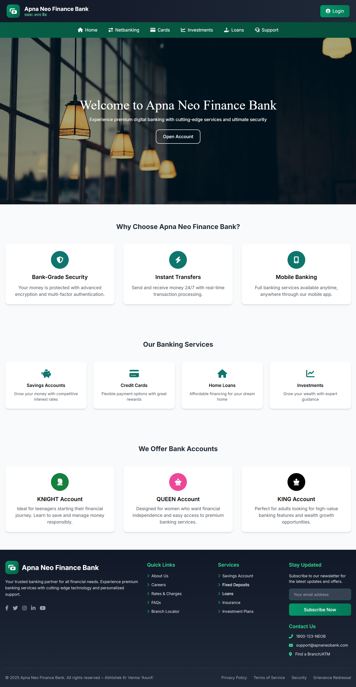 | 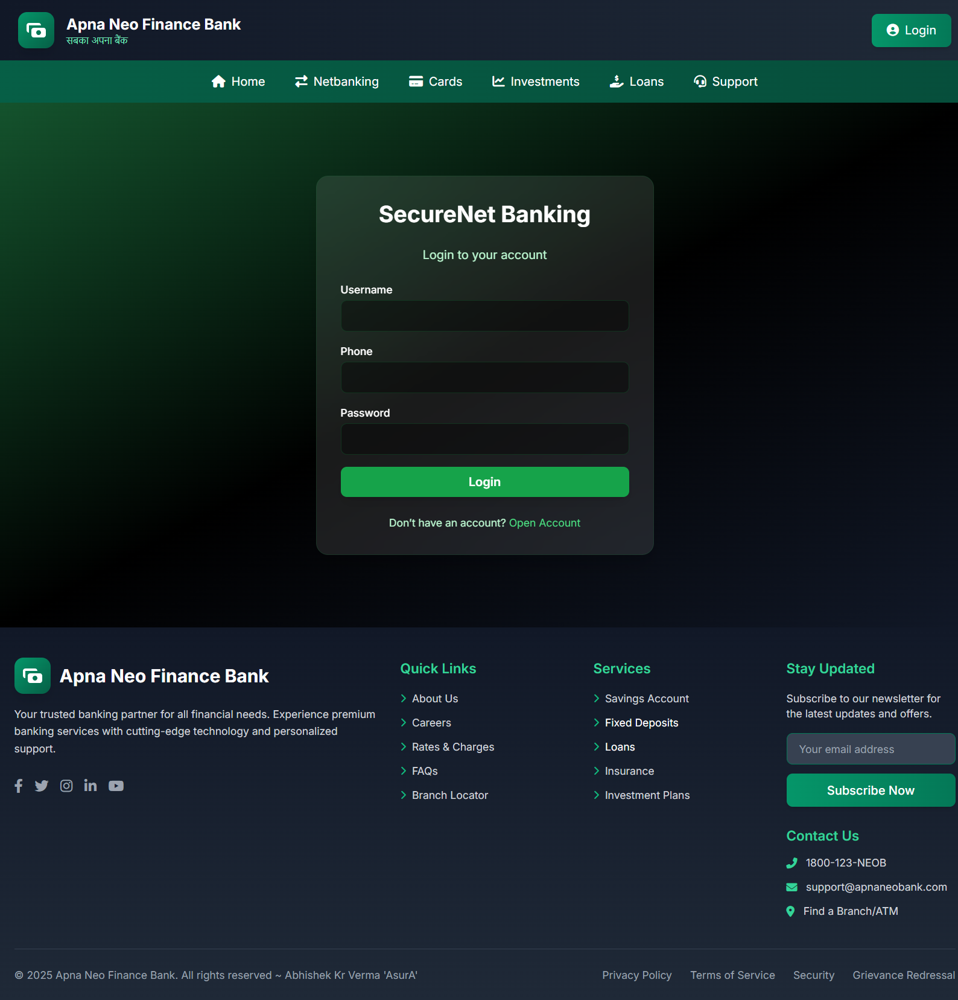 | 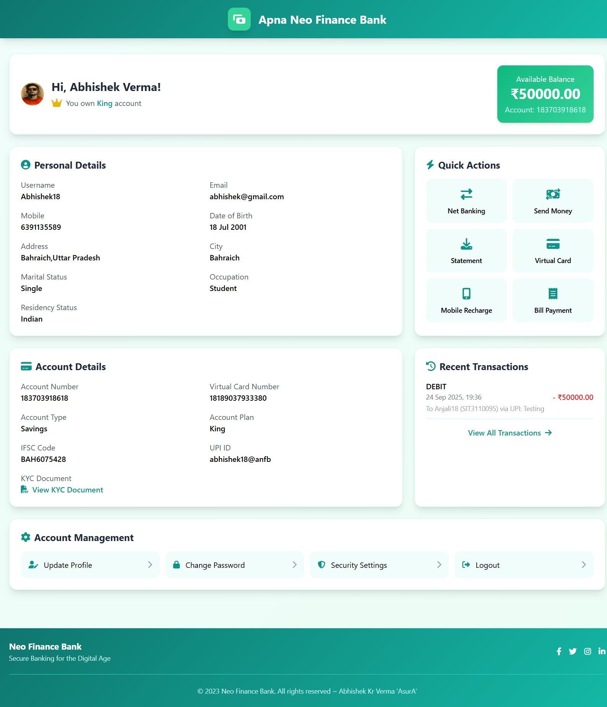 |

| Loan                                      | Cards                                      | Account Open                                             |
| ----------------------------------------- | ------------------------------------------ | -------------------------------------------------------- |
|  | 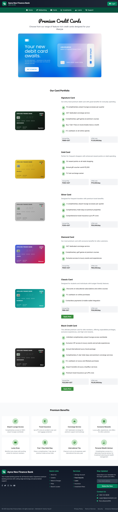 | 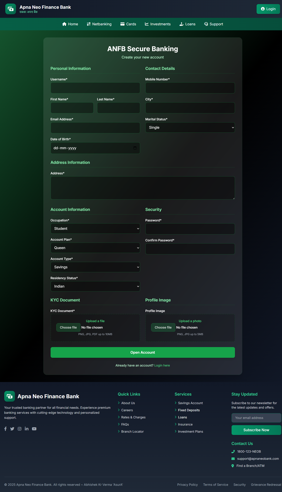 |

| Investment                                            | Branch Finder                                             | Support                                       |
| ----------------------------------------------------- | --------------------------------------------------------- | --------------------------------------------- |
|  |  | 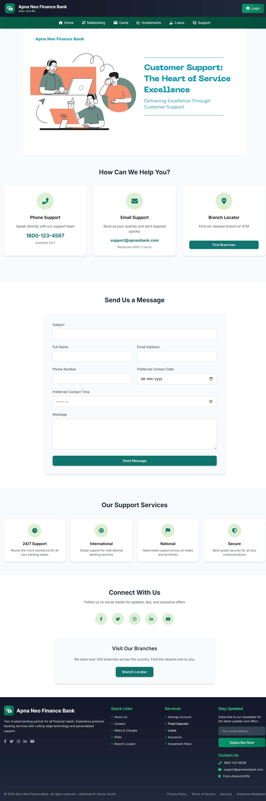 |

| Fund Transfer                                             | Transaction History                                                   | Profile Update                                              |
| --------------------------------------------------------- | --------------------------------------------------------------------- | ----------------------------------------------------------- |
| 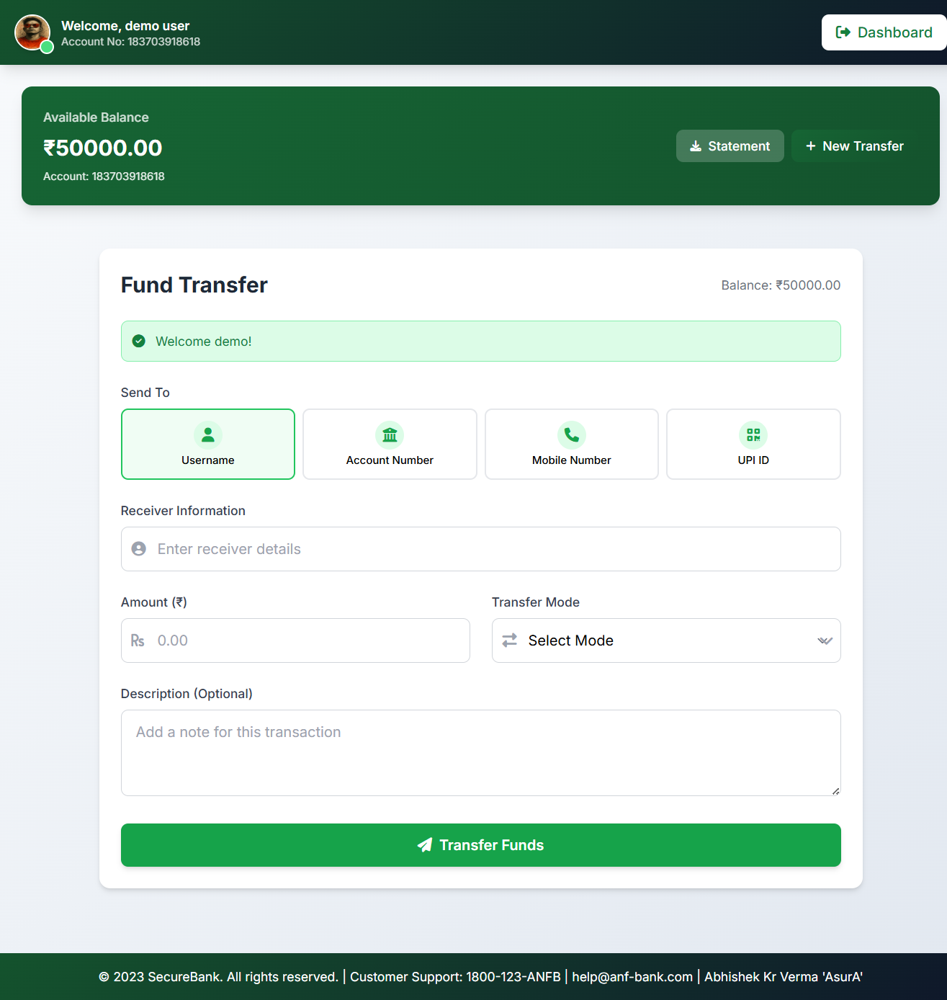 | 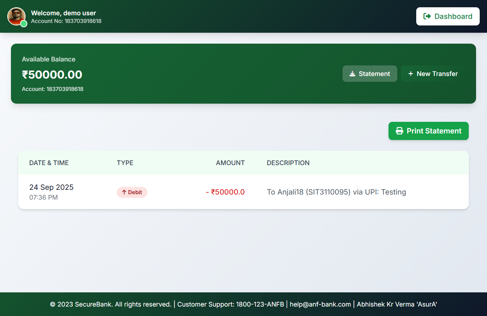 | 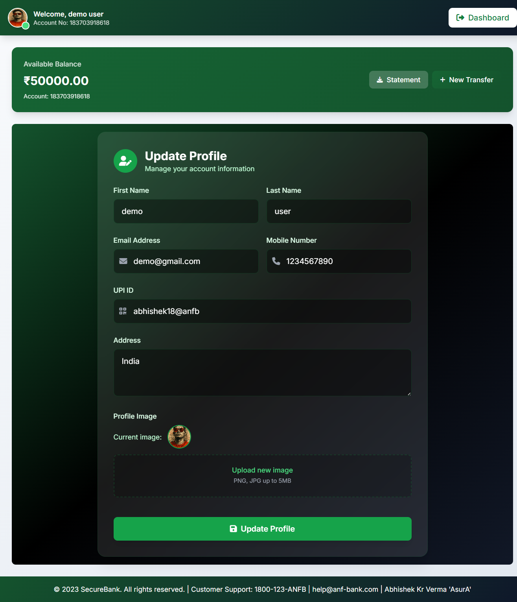 |

| Virtual Card                                            | Banking Dashboard                                                | Change Password                                              |
| ------------------------------------------------------- | ---------------------------------------------------------------- | ------------------------------------------------------------ |
| 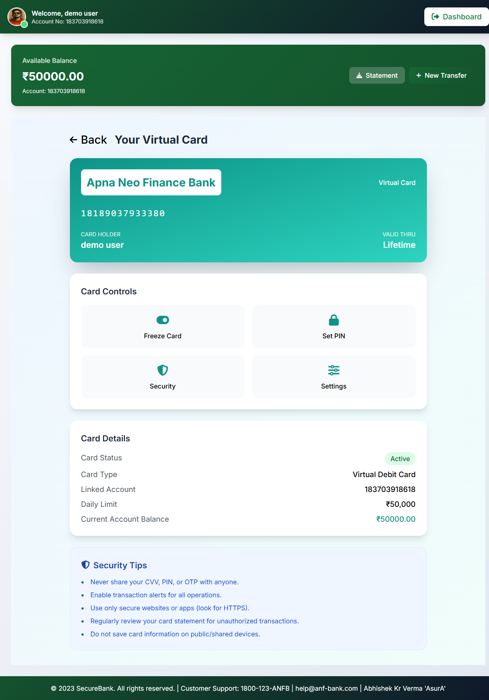 | 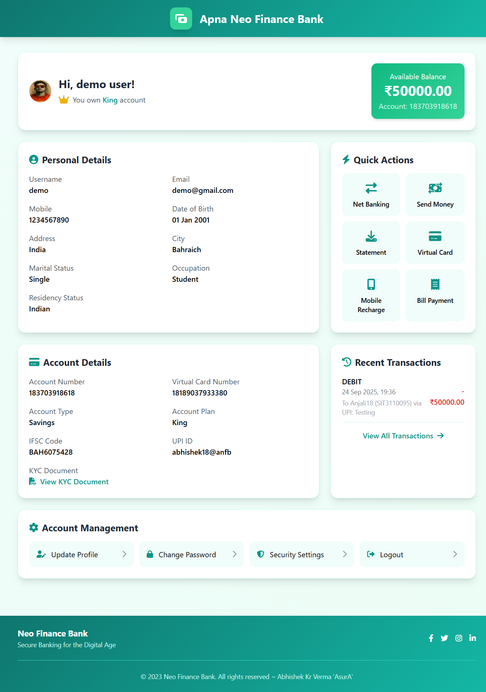 | 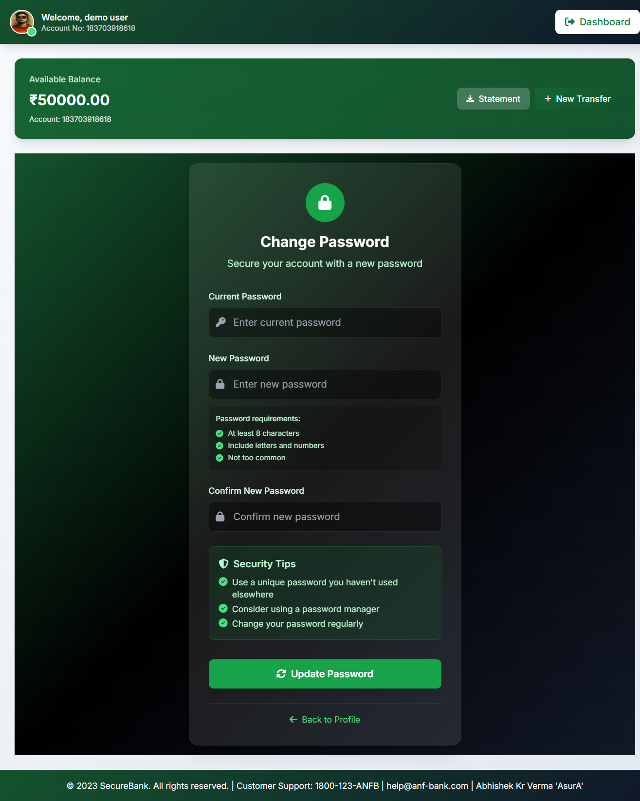 |

| Net Banking                                          | Coming Soon                                                |
| ---------------------------------------------------- | ---------------------------------------------------------- |
| 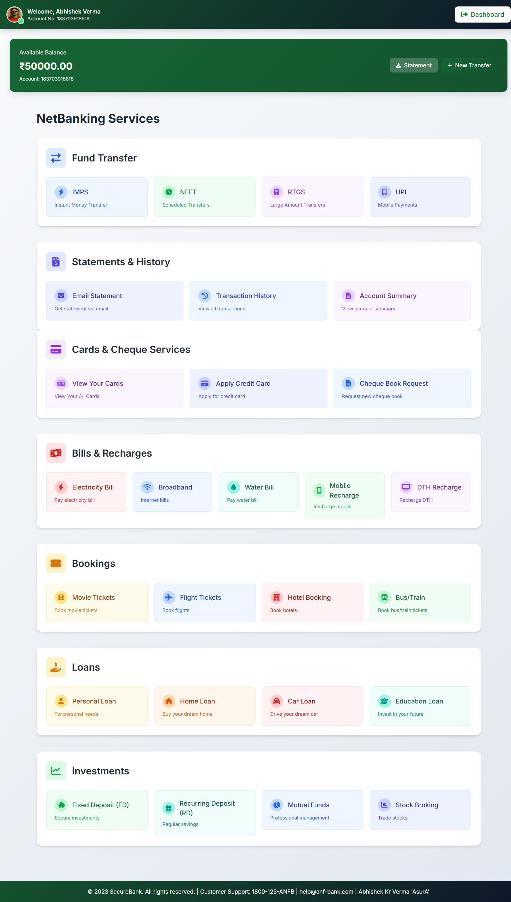 | 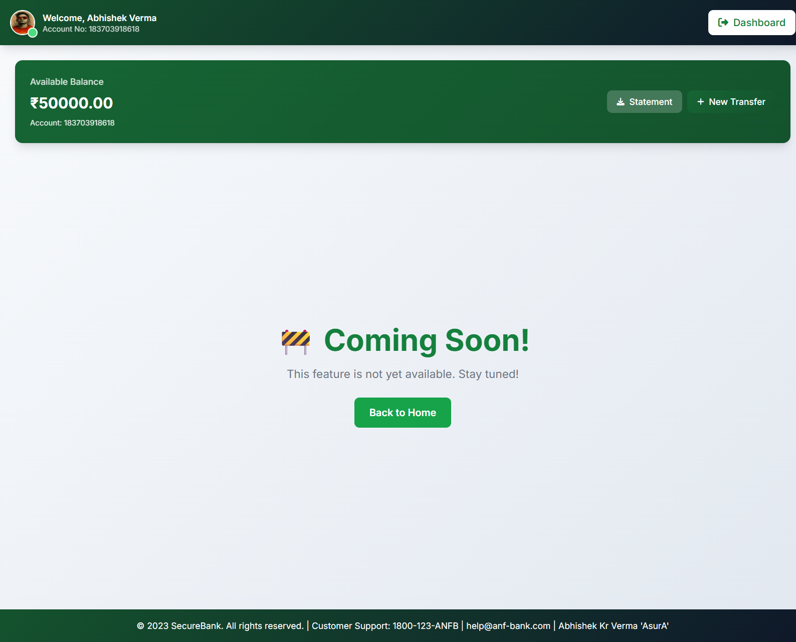 |

---

## 🔮 Future Roadmap

* 🔔 Real-time Notifications
* 💼 Advanced Admin Panel
* 🔗 REST API Development
* 💳 Payment Gateway Integration
* 🌍 Multi-language Support
* 🔒 Advanced Security Features

---

## 🐛 Troubleshooting

* **Database issues**: `python manage.py makemigrations && python manage.py migrate`


---

# 📄 License

This project is licensed under **MIT License**.

---

